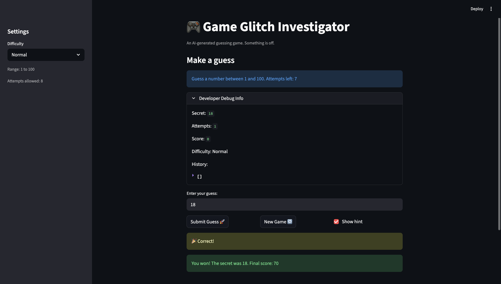

# 🎮 Game Glitch Investigator: The Impossible Guesser

## 🚨 The Situation

You asked an AI to build a simple "Number Guessing Game" using Streamlit.
It wrote the code, ran away, and now the game is unplayable. 

- You can't win.
- The hints lie to you.
- The secret number seems to have commitment issues.

## 🛠️ Setup

1. Install dependencies: `pip install -r requirements.txt`
2. Run the broken app: `python -m streamlit run app.py`

## 🕵️‍♂️ Your Mission

1. **Play the game.** Open the "Developer Debug Info" tab in the app to see the secret number. Try to win.
2. **Find the State Bug.** Why does the secret number change every time you click "Submit"? Ask ChatGPT: *"How do I keep a variable from resetting in Streamlit when I click a button?"*
3. **Fix the Logic.** The hints ("Higher/Lower") are wrong. Fix them.
4. **Refactor & Test.** - Move the logic into `logic_utils.py`.
   - Run `pytest` in your terminal.
   - Keep fixing until all tests pass!

## 📝 Document Your Experience

- [ ] Describe the game's purpose.
# The purpose of the game is to let the player guess a secret number within a limited number of attempts. The app gives feedback after each guess, such as whether the guess is too high, too low, or correct. It also has different difficulty levels, which change the guessing range and number of attempts.
- [ ] Detail which bugs you found.
# I found multiple bugs while testing the app.

# First, the hint messages were backwards. If my guess was higher than the secret number, the app told me to go higher instead of lower. If my guess was lower, it told me to go lower instead of higher.

# Second, the guess checking logic was inconsistent. The app was sometimes comparing the guess to an integer secret and other times to a string version of the secret. Because of that, correct guesses were not always recognized properly, and the game sometimes behaved differently depending on the attempt.

# Third, the New Game button did not fully reset the game state. In some cases, after winning and starting a new game, the app would not let me submit guesses properly until the page was refreshed.

# I also noticed that the attempts logic felt inconsistent across game modes because the state was not being handled cleanly.
- [ ] Explain what fixes you applied.
# To fix the hint bug, I corrected the comparison logic in the check_guess() function. Now if the guess is higher than the secret, the game says “Too High” and tells the player to go lower. If the guess is lower than the secret, it says “Too Low” and tells the player to go higher.

# To fix the inconsistent guessing behavior, I removed the logic that sometimes converted the secret number to a string. I made the game always use st.session_state.secret directly, so the comparisons stay consistent.

# To improve the structure of the code, I moved the game logic functions into logic_utils.py. This included helper functions like:
	•	get_range_for_difficulty()
	•	parse_guess()
	•	check_guess()
	•	update_score()

#I also updated my tests so they matched the actual output of check_guess(), which returns both an outcome and a message.

## 📸 Demo

## 🚀 Stretch Features

- [ ] [If you choose to complete Challenge 4, insert a screenshot of your Enhanced Game UI here]
